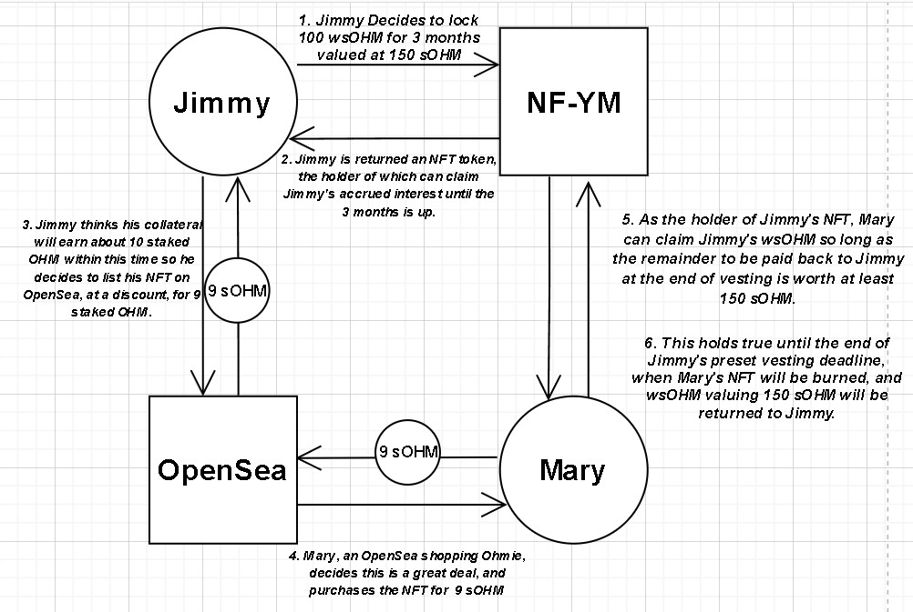

# NonFungibleStakingYield

## Deposit
Lockup some wsOHM, with a supplied epoch deadline (`vestingTerm`), and you'll be minted an NFT who's holder can claim your accrued interest from staking until the end of vesting.

```Javascript
function deposit(
    address depositor,
    uint amount, 
    uint vestingTerm
) external;
```
## Withdraw
Allows an NFT's minter to cancel the contract, release their funds, and burn the NFT.

Note: Depositor/Minter must be holding the minted NFT

```Javascript
function withdraw(
    uint tokenId
) external;
```

## Redeem
Allows the holder of a given token to redeem any interest that's been acrued from the depositor's collateral.

Note: If vesting is over, the NFT's burned and payout is nothing. Depositor also has the right to call this function.

```Javascript
function redeem( 
    uint tokenId
) external;
```


## 🤨 How it all works


